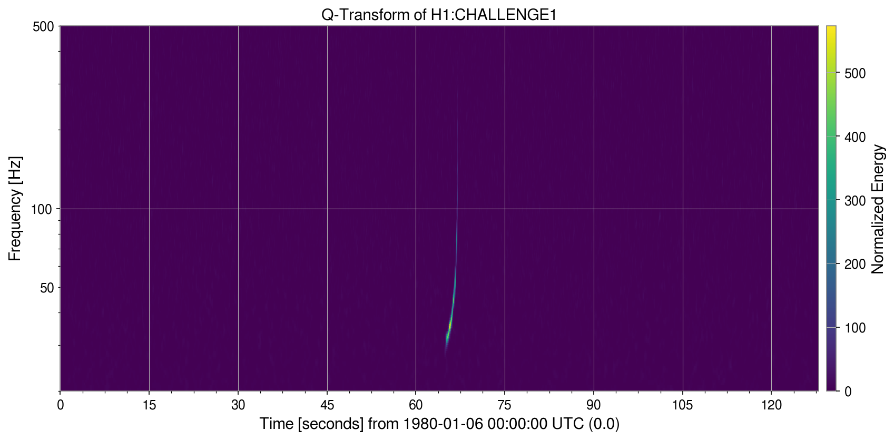
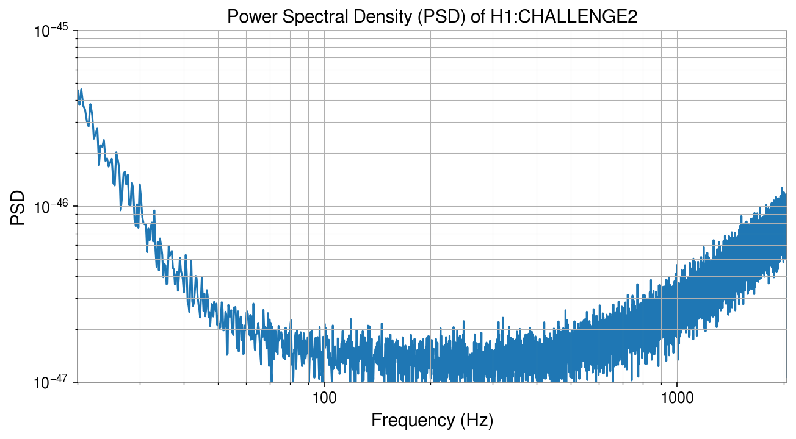
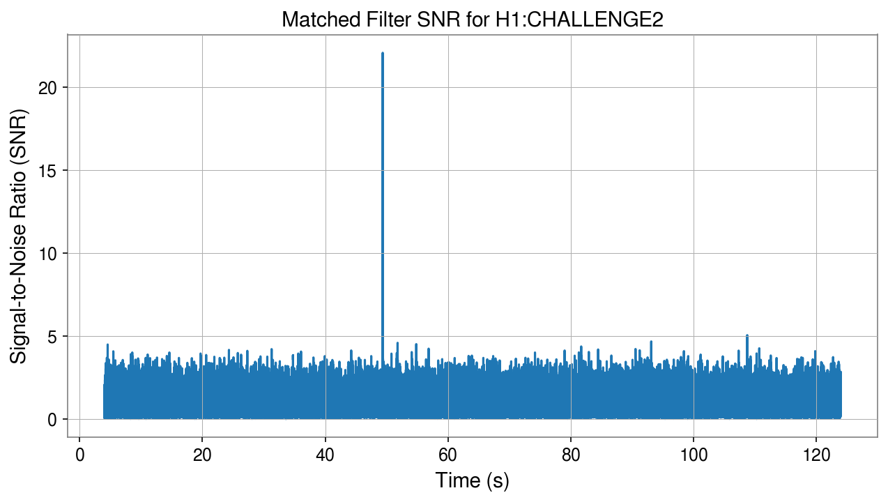
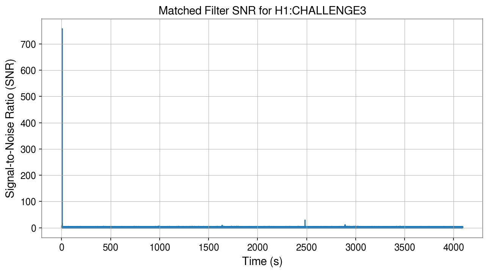
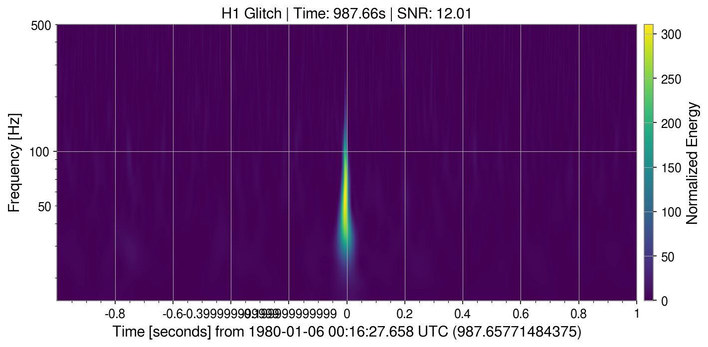
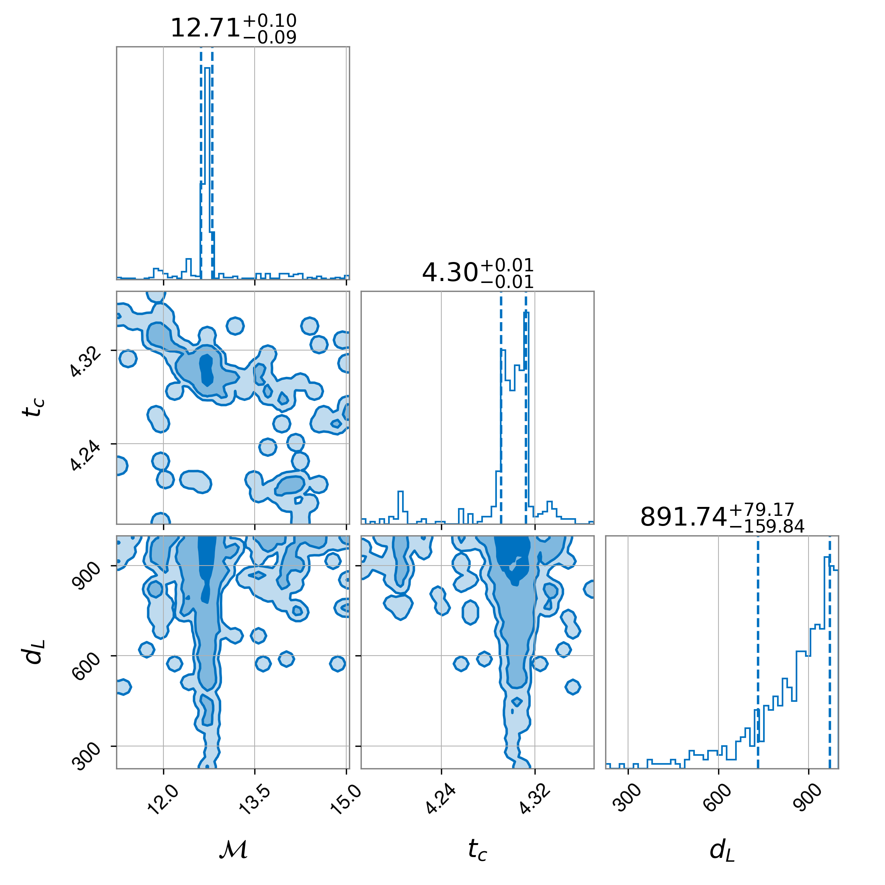

# 🌌 Gravitational Wave Data Analysis — GWOSC Open Data Workshop 2026

> A complete solution to the GWOSC Open Data Workshop 2026 Data Challenge, covering signal detection, matched filtering, glitch identification, and Bayesian parameter estimation of binary black hole (BBH) coalescences.

---

## 📋 Table of Contents

- [Overview](#overview)
- [Challenge Structure](#challenge-structure)
- [Repository Structure](#repository-structure)
- [Installation](#installation)
- [Data](#data)
- [Usage](#usage)
- [Technologies](#technologies)
- [Contact](#contact)

---

## Overview

This project solves the four challenges of the GWOSC Open Data Workshop 2026, progressing from basic signal visualization to a full Bayesian parameter estimation pipeline. The signals analyzed correspond to binary black hole (BBH) mergers injected into both simulated Gaussian noise and real LIGO O2 detector data. The file `GWOSC_workshop.ipynb` contains the code, and more detailed explanaition and discussion.
---

## Challenge Structure

### 🟢 Challenge 1: Visual Detection in White Noise

**Goal:** Identify the merger time of a loud BBH signal in white Gaussian noise using the Q-Transform.

- Data: `challenge1.gwf` / Channel: `H1:CHALLENGE1`
- Method: Q-Transform visualization (`frange=(20, 500)`, `qrange=(4, 64)`)
- Result: Merger time identified at **t ≈ 66.97 s**

 

---

### 🟡 Challenge 2: Matched Filtering in Colored Noise

**Goal:** Extract a BBH signal (m₁ = m₂ = 30 M☉, zero spin) from colored Gaussian noise.

- Data: `challenge2.gwf` / Channel: `H1:CHALLENGE2`
- Template: `SEOBNRv4_opt` waveform approximant
- PSD: Estimated via Welch's method
- Result: Peak SNR = **22.08** at **t ≈ 49.37 s**

 


---

### 🟠 Challenge 3: Real LIGO Data

**Goal:** Detect a loud BBH event (m₁ = m₂ = 10 M☉) in real LIGO O2 data using matched filtering and simulated signals.

- Data: `challenge3.gwf` / Channel: `H1:CHALLENGE3`
- Method: Same matched filtering pipeline as Challenge 2.
- Result: Peak SNR = **757.44** at **t ≈ 5.97 s**

 -->

---

### 🔴 Challenge 4: Blind Search & Parameter Estimation

**Goal:** Blind search for multiple BBH signals in coincident H1 + L1 data, identify glitches, and perform Bayesian parameter estimation.

- Data: `challenge3.gwf` / Channels: `H1:CHALLENGE3`, `L1:CHALLENGE3`
- Template bank: $m_1=m_2\in {10, 15, 20, 25, 30, 35, 40, 45, 50}$ M☉.
- Sampler: Dynesty (Nested Sampling) via `bilby`

#### Detected Astrophysical Signals

| Time (s) | m₁ = m₂ (M☉) | SNR H1 | SNR L1 | Net SNR |
|----------|--------------|--------|--------|---------|
| 4.27 | 15 | 9.09 | 10.60 | 13.97 |
| 5.97 | 10 | 757.44 | 337.81 | 829.36 |
| 826.43 | 30 | 8.46 | 11.75 | 14.47 |
| 1101.43 | 30 | 13.28 | 14.61 | 19.74 |
| 1638.15 | 20 | 20.46 | 18.57 | 27.63 |
| 2483.97 | 10 | 29.01 | 33.87 | 44.59 |
| 2892.71 | 25 | 31.99 | 32.49 | 45.60 |
| 3219.18 | 40 | 12.20 | 13.89 | 18.49 |

#### Identified Glitches

| Detector | Time (s) | SNR |
|----------|----------|-----|
| H1 | 4.67 | 10.67 |
| H1 | 987.66 | 12.01 |
| H1 | 2483.94 | 10.25 |
| H1 | 3219.19 | 8.53 |
| L1 | 4.42 | 13.24 |
| L1 | 196.08 | 17.26 |
| L1 | 826.42 | 8.69 |
| L1 | 1101.43 | 8.58 |
| L1 | 4091.38 | 8.44 |

 

#### Bayesian Parameter Estimation (Earliest Event — t ≈ 4.27 s)

- Sampler: `dynesty` (nlive=100)
- Waveform: `IMRPhenomPv2`
- Fixed parameters: q = 1, spin = 0

**Result:**
> m₁,₂ = **13.73 – 16.25 M☉** (90% CI), median = **14.60 M☉**

 -->

---

## Repository Structure

```
gwosc-workshop-2026/
│
├── Data/                        # GWF data files (not included — see Data section)
│   ├── challenge1.gwf
│   ├── challenge2.gwf
│   └── challenge3.gwf
│
├── challenge4_results/          # Bilby output (posteriors, checkpoints)
│
├── images/                      # Plots and figures for the README
│
├── GWOSC_workshop.ipynb         # Main Jupyter notebook with all challenges
├── environment.yml              # Conda environment specification
├── .gitignore
└── README.md
```

---

## Installation

### Prerequisites

- [Conda](https://docs.conda.io/en/latest/miniconda.html) or [Mamba](https://mamba.readthedocs.io/)
- Python 3.12+

### Setup

```bash
# 1. Clone the repository
git clone https://github.com/diegofranco2410/gwosc-workshop-2026.git
cd gwosc-workshop-2026

# 2. Create the conda environment from the provided file
conda env create -f environment.yml

# 3. Activate the environment
conda activate odw-py312

# 4. Buil a custom jupyter-kernel
python -m ipykernel install --user --name odw-py312 --display-name "Python (odw-py312)"

# 5. Launch Jupyter
jupyter notebook GWOSC_workshop.ipynb
```

> **Note:** A `requirements.txt` is not included separately since all dependencies are fully specified in `environment.yml`.

---

## Data

The `.gwf` data files are **not included** in this repository due to their size. Download them from the official GWOSC workshop page and place them in a `Data/` folder at the root of the project:

```
Data/
├── challenge1.gwf
├── challenge2.gwf
└── challenge3.gwf
```

🔗 **Data source:** [GWOSC Open Data Workshop](https://gwosc.org/workshops/)

---

## Usage

All challenges are contained in a single self-documented Jupyter notebook: `GWOSC_workshop.ipynb`.

Run all cells sequentially. Each challenge section is clearly delineated and includes:
- Data loading and visualization
- Signal processing pipeline
- Results and observations

For Challenge 4, the Bilby sampler takes approximately **~10 hours** on a standard CPU. Intermediate checkpoints are saved automatically to `challenge4_results/`.

---

## Technologies

| Library | Purpose |
|---------|---------|
| [GWpy](https://gwpy.github.io/) | Time-series handling, Q-Transform visualization |
| [PyCBC](https://pycbc.org/) | Waveform generation, PSD estimation, matched filtering |
| [Bilby](https://bilby-dev.github.io/bilby/) | Bayesian inference, posterior estimation |
| [Dynesty](https://dynesty.readthedocs.io/) | Nested sampling backend |
| NumPy / SciPy | Numerical computation, peak finding |
| Matplotlib | Visualization |

---

## Contact

**Diego Franco** — B.Sc. Physics & Data Science Practitioner

[](https://www.linkedin.com/in/diegofranco2410)
[](mailto:diegofranco2410@gmail.com)
